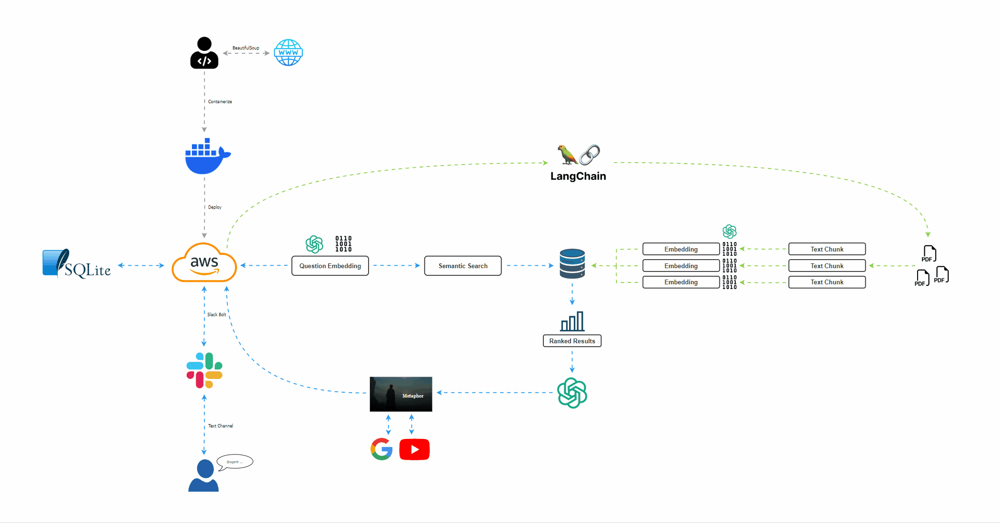

# Custom Knowledge Slack RAG Agent


## Overview
This is a Slack Chatbot that can be easily trained on text data fed into the `/custom_knowledge` directory.

## Features
- Fetches data from the internet
- Maintains individual dialoguecc between each user in the same Slack channel
- Remembers your chat history
- Has a text generation animation
- Remembers previous channels
- Easily customizable knowledge-base

## Getting Started
1. Clone this repository locally.
2. Install Python 3.9 and Poetry.
3. Create virtual environment and install project dependencies using `poetry install --no-dev`.
4. Configure your `.env` file with Keys/Tokens. Example `.env` file:
```
# Directories
directory_path=os.environ.get("CUSTOM_KNOWLEDGE_DIRECTORY") # docker path

# Slack App Tokens
SOCKET_TOKEN=
SLACK_BOT_TOKEN=  # BOT_USER_OAUTH_TOKEN
SLACK_BOT_USER_ID=

# Other
OPENAI_API_KEY=
METAPHOR_API_KEY=
```
5. Add your custom knowledge to `/custom_knowledge`.
6. Run the AI agent using `python app.py`.

## Requirements
- LLM API Key
- Metaphor API Key (for internet data retrieval)
- Slack: Socket Token, Bot Token, Bot User ID

## Demonstration

